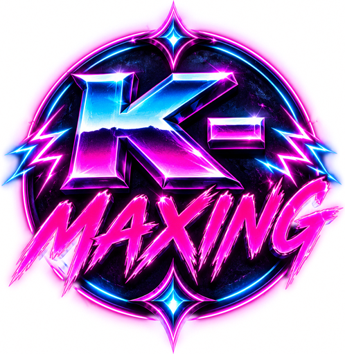
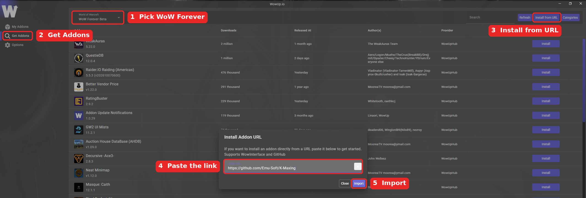

  

<h1 align="center">K-Maxing</h1>

  <i>Everyone wants Balenciaga. It is not given to all.</i> 

  <a href="../../releases/latest"><b>Download the latest release</b></a> &nbsp;·&nbsp; <a href="#with-wowup-recommended"><b>Install with WowUp</b></a>

---

## Installing

### With WowUp (recommended)

[WowUp](https://wowup.io) installs the addon for you and keeps it up to date.

1. Open WowUp and pick **WoW Forever** in the game dropdown at the top left.
2. Click **Get Addons** on the left, then **Install from URL** at the top right.
3. Paste `https://github.com/Emu-Soft/K-Maxing` into the box and click **Import**.
4. Restart the game (a `/reload` isn't enough the first time).

From then on, WowUp shows an update whenever a new version is released.

### Manually

1. Download the **K-Maxing** zip from the [latest release](../../releases/latest).
2. Unzip it. You'll get a folder called `K-Maxing`.
3. Put that folder in your WoW: Forever `Interface\AddOns` folder. The folder name must stay exactly `K-Maxing`.
4. Restart the game (a `/reload` isn't enough the first time).

To update, replace the `K-Maxing` folder with the one from the newest release. Your settings are kept.

## What it does

In a 5-player dungeon, the moment you become the **#1 damage dealer** on Forever's built-in damage meter:

- **The music starts.** Your own soundtrack plays for as long as you hold the top spot.
- **The logo appears** and pulses to the beat, with a glow that strobes through neon colours. The louder the track gets, the bigger and faster it goes.
- **A timer counts** how long you've been #1, to the thousandth of a second.

Lose the top spot for more than a moment and the timer freezes in red while the music fades out.

**Avada Balenciaga:** if the player who takes #1 from you is also running K-Maxing, you'll see *"<name> has stolen your Balenciaga"*, with a sound to match. The game hides player names in combat, so this only fires when it can tell who took it. Otherwise you get the normal fade-out.

### Good to know
- It only works **inside 5-player dungeons**, and only reads Forever's own damage meter, so keep that meter turned on.
- The soundtrack plays through the game's **Music** channel. If your music is muted, you won't hear it.
- K-Maxing users in your group find each other automatically, so the steal banner can name the thief.

## Commands

| Command | What it does |
|---|---|
| `/kmax` | Open the options. |
| `/bmdiag` | Print what K-Maxing can see of the damage meter. Handy when it isn't triggering: run it mid-fight in a dungeon. |

## Options (`/kmax`)

- **Fonts** for the timer and the "stolen" banner. Fonts from LibSharedMedia are listed too, if you have an addon that provides it.
- **Size sliders** for the timer and the banner.
- **Previews:** show the timer, show the banner, or run a 3-second "get stolen" test.
- **Unlock Frames:** drag the logo, timer and banner wherever you like. They snap to each other, and holding **Alt** snaps them to the centre of the screen.

## Credits

The music was made with AI.
